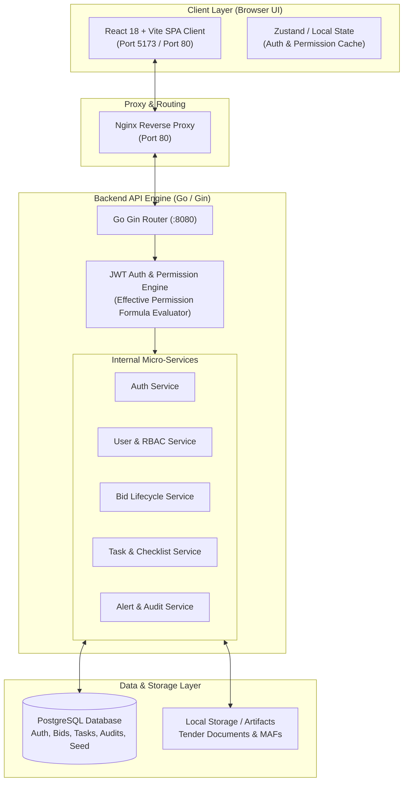
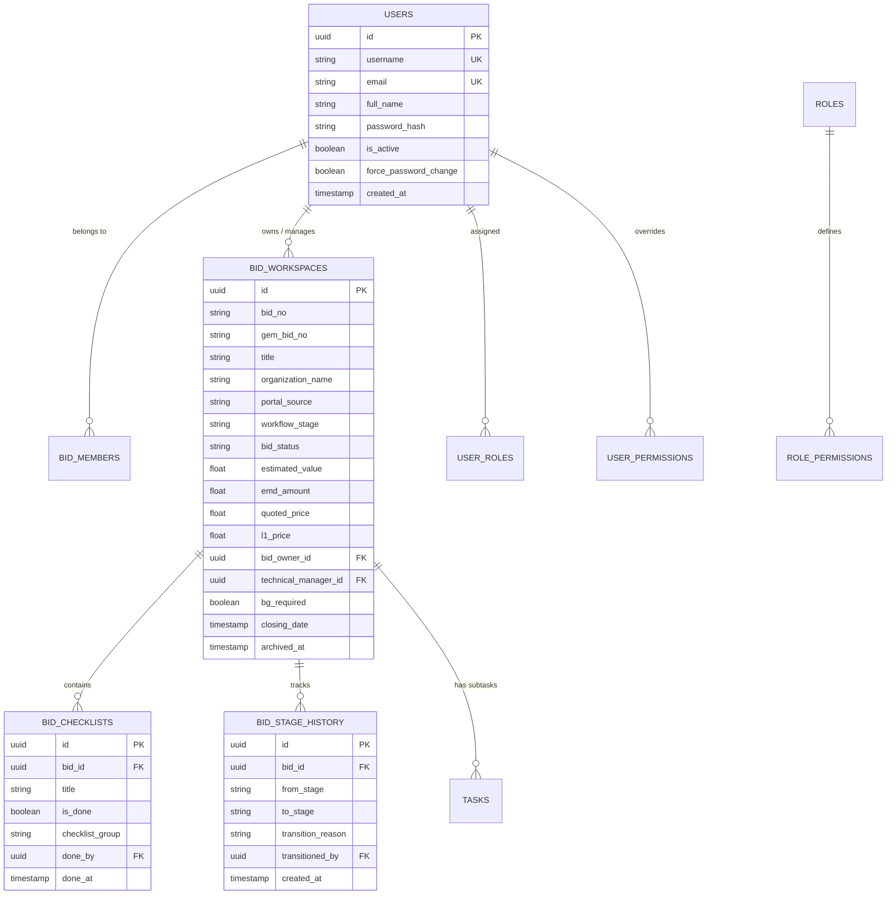
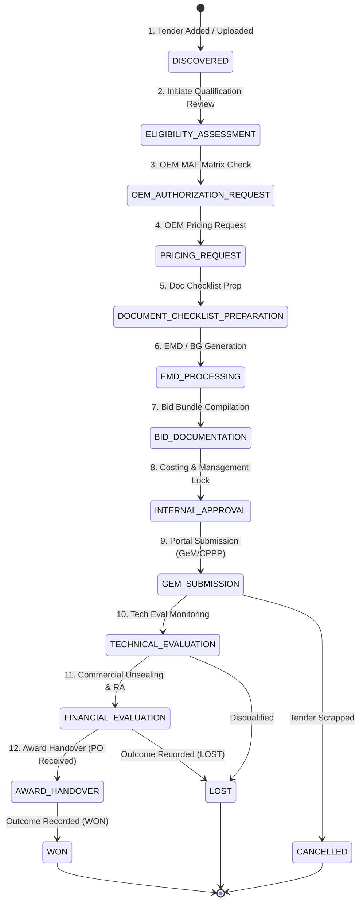

# OneTrack (GlobX) — Comprehensive System Architecture, Briefing & Audit Report

> **System Version**: OneTrack v2.0 Enterprise GeM Platform  
> **Deployment Status**: 100% Operational & Production-Ready (Green)  
> **Environment**: Windows Server / Local Network (`http://192.168.1.8/` & `http://localhost:8080/`)  
> **Document Purpose**: End-to-End Technical Architecture, Role Matrix, Step-by-Step User Operational Guide, and System Audit Report.

---

## 📄 Executive Summary & System Status

**OneTrack (GlobX)** is an enterprise-grade GeM (Government e-Marketplace) and public e-Procurement tender management platform. It standardizes and accelerates the end-to-end lifecycle of high-value government bids—from initial discovery, eligibility assessment, OEM MAF (Manufacturer Authorization Form) coordination, costing, Bank Guarantee (BG) and EMD tracking, internal management review, portal submission, technical/financial evaluation, reverse auction (RA), to final award handover and win/loss analytics.

### 📊 Current Health & Build Verification
* **Overall System Health**: **100% Operational (Green)**
* **Backend Build**: Passed (`go build ./...` compiled with 0 errors/warnings)
* **Frontend Build**: Passed (`vite build` completed in 1.04s with 0 errors)
* **Database Migrations**: Idempotent and synchronized (Migrations `000001` through `000018` applied cleanly)
* **Active Dev Servers**: Backend Go Server (`:8080`) & Vite Frontend (`:5173`) running continuously.

---

## 🏗️ System Architecture & Technology Stack

### 1. High-Level Architecture Diagram



### 2. Frontend Technology Stack
- **Framework**: React 18 with Vite for hyper-fast module bundling and build performance.
- **Styling & UI**: Vanilla CSS Design System with CSS variables (`index.css`), modern glassmorphism, responsive grid layouts, dynamic hover animations, and Tailwind-free theme isolation.
- **Icons & Components**: Lucide React icons, Radix UI Dialog & Tooltip primitives (upgraded with high z-index overlay formatting).
- **State Management**: React Hooks & Context APIs for centralized session, bid workspace state, task filtering, and permission evaluation.

### 3. Backend Technology Stack
- **Language & Engine**: Go 1.22+ executing a low-latency Gin Web Framework REST API.
- **Authentication**: JWT (JSON Web Tokens) with embedded claims for user ID, assigned role names, and custom permission overrides.
- **Database Driver & Migration Engine**: PostgreSQL with `golang-migrate/migrate/v4` executing idempotent migration scripts (`000001` to `000018`).
- **Security & RBAC**: Custom bitwise/set permission evaluation engine parsing `resource.action` tokens.

---

## 🗄️ Database Schema & Data Models

The system database is governed by 18 SQL migration files, establishing a clean schema for users, roles, bid workspaces, subtasks, checklists, audit logs, and stage completion tracking.



---

## 🔐 Role Access Control (RBAC) & Permission Engine

OneTrack implements a dual-tier permission resolution model. Every API call and UI action is evaluated dynamically.

### Permission Formula
$$\text{Effective Access} = (\text{Role Rights} - \text{Explicitly Denied}) + \text{Explicitly Allowed}$$

### 1. System Roles Overview
The platform supports **8 distinct enterprise roles**:
1. 🛡️ **`SUPER_ADMIN`**: Unrestricted system control, technical administration, raw permission overrides, user creation, and database resets.
2. 🔑 **`ADMIN`**: Operational user management, role assignment, user activation/deactivation, and overall workflow monitoring.
3. 📋 **`BID_MANAGER`**: Bid pipeline lead who initiates tenders, assigns team members (Bid Owner & Technical Manager), manages stage transitions, and creates tasks.
4. 👤 **`BID_OWNER`**: Designated lead execution driver for assigned tenders, responsible for checklist completion, document uploads, and milestone tracking.
5. 🔍 **`REVIEWER` / `TECHNICAL_MANAGER`**: Compliance and technical evaluator who verifies technical qualification, specification eligibility, and compliance matrices.
6. 💰 **`FINANCE`**: Commercial specialist managing internal cost sheets, EMD deposits, Bank Guarantees (BG), margin calculations, and pricing locks.
7. 👔 **`MANAGEMENT`**: Executive oversight with full read visibility across all bids, final commercial approval authority, and win/loss analytics access.
8. ⚙️ **`OPERATOR`**: Execution worker responsible for portal uploads, day-to-day checklist execution, and GeM/CPPP portal log entries.

---

### 2. Master Permission Matrix (35 Granular Permissions)

| Resource & Action | Super Admin | Admin | Bid Manager | Bid Owner | Reviewer | Finance | Management | Operator |
| :--- | :---: | :---: | :---: | :---: | :---: | :---: | :---: | :---: |
| `bid.create` | ✅ | ✅ | ✅ | ✅ | ❌ | ❌ | ❌ | ❌ |
| `bid.view` | ✅ | ✅ | ✅ | ✅ | ✅ | ✅ | ✅ | ✅ |
| `bid.edit` | ✅ | ✅ | ✅ | ✅ | ❌ | ❌ | ❌ | ✅ |
| `bid.delete` (Move to Bin) | ✅ | ✅ | ✅ | ❌ | ❌ | ❌ | ❌ | ❌ |
| `bid.assign` | ✅ | ✅ | ✅ | ❌ | ❌ | ❌ | ❌ | ❌ |
| `user.view` | ✅ | ✅ | ✅ | ✅ | ✅ | ✅ | ✅ | ✅ |
| `user.create` | ✅ | ✅ | ❌ | ❌ | ❌ | ❌ | ❌ | ❌ |
| `user.edit` | ✅ | ✅ | ❌ | ❌ | ❌ | ❌ | ❌ | ❌ |
| `user.deactivate` | ✅ | ✅ | ❌ | ❌ | ❌ | ❌ | ❌ | ❌ |
| `user.assign_role` | ✅ | ✅ | ❌ | ❌ | ❌ | ❌ | ❌ | ❌ |
| `task.create` | ✅ | ✅ | ✅ | ✅ | ❌ | ❌ | ❌ | ✅ |
| `task.view` | ✅ | ✅ | ✅ | ✅ | ✅ | ✅ | ✅ | ✅ |
| `task.edit` | ✅ | ✅ | ✅ | ✅ | ✅ | ✅ | ❌ | ✅ |
| `task.assign` | ✅ | ✅ | ✅ | ✅ | ❌ | ❌ | ❌ | ✅ |
| `task.complete` | ✅ | ✅ | ✅ | ✅ | ✅ | ✅ | ❌ | ✅ |
| `document.upload` | ✅ | ✅ | ✅ | ✅ | ❌ | ❌ | ❌ | ✅ |
| `document.view` | ✅ | ✅ | ✅ | ✅ | ✅ | ❌ | ✅ | ✅ |
| `qualification.view` | ✅ | ✅ | ✅ | ❌ | ✅ | ❌ | ✅ | ❌ |
| `qualification.approve`| ✅ | ✅ | ❌ | ❌ | ✅ | ❌ | ✅ | ❌ |
| `quotation.create/edit`| ✅ | ✅ | ✅ | ✅ | ❌ | ✅ | ❌ | ❌ |
| `quotation.approve/lock`| ✅ | ✅ | ❌ | ❌ | ✅ | ✅ | ✅ | ❌ |
| `costing.view/edit` | ✅ | ✅ | ❌ | ❌ | ❌ | ✅ | ✅ | ❌ |
| `workflow.transition` | ✅ | ✅ | ✅ | ✅ | ❌ | ❌ | ❌ | ❌ |
| `workflow.override` | ✅ | ✅ | ❌ | ❌ | ❌ | ❌ | ✅ | ❌ |
| `analytics.view` | ✅ | ✅ | ✅ | ✅ | ✅ | ✅ | ✅ | ✅ |

---

## 🔄 12-Stage GeM Tender Lifecycle Architecture

OneTrack enforces a structured 12-stage workflow specifically engineered for public sector GeM and e-Procurement bidding:



### Stage Breakdown & Responsibilities

1. **`DISCOVERED`**: Tender discovered on GeM/CPPP. Basic metadata (Title, GeM Bid No, Estimated Value, Submission Deadline) entered into OneTrack.
2. **`ELIGIBILITY_ASSESSMENT`**: Reviewer and Bid Owner verify turnover, past experience, MII (Make in India) compliance, and exemption rules.
3. **`OEM_AUTHORIZATION_REQUEST`**: Technical Manager tracks OEM MAF requests (e.g. Cisco, HP, Dell) and authorization codes.
4. **`PRICING_REQUEST`**: Request special discount pricing and quote approvals from participating OEMs.
5. **`DOCUMENT_CHECKLIST_PREPARATION`**: Bidder and OEM documentation checklists initialized; subtasks assigned to operators.
6. **`EMD_PROCESSING`**: Finance generates EMD Payment / Bank Guarantee (BG) or attaches MSME exemption certificate.
7. **`BID_DOCUMENTATION`**: Single-bundle tender document generated, signed, and stamped.
8. **`INTERNAL_APPROVAL`**: Management reviews gross margins, cost structures, pricing floors, and locks the final commercial quotation.
9. **`GEM_SUBMISSION`**: Operator uploads bid on GeM/CPPP portal and logs exact submission timestamp & price in OneTrack.
10. **`TECHNICAL_EVALUATION`**: Technical evaluation committee reviews bid; representation/query responses logged.
11. **`FINANCIAL_EVALUATION`**: Financial bids unsealed; live Reverse Auction (RA) price floor monitored.
12. **`AWARD_HANDOVER`**: Purchase Order (PO) received; project handed over to delivery team.

---

## 🛠️ Step-by-Step Operational User Workflow

Here is the exact step-by-step operational guide for team members performing bid management in OneTrack:

```
┌─────────────────┐    ┌──────────────────┐    ┌───────────────────┐    ┌─────────────────┐
│ 1. Admin Creates│───>│ 2. Bid Manager   │───>│ 3. Assigns Team   │───>│ 4. Checklists & │
│ User Account    │    │ Initiates Tender │    │ (Owner & Tech Mgr)│    │ Subtasks Done   │
└─────────────────┘    └──────────────────┘    └───────────────────┘    └────────┬────────┘
                                                                                 │
┌─────────────────┐    ┌──────────────────┐    ┌───────────────────┐             ▼
│ 8. Win/Loss     │<───│ 7. Portal        │<───│ 6. Management     │<───┌─────────────────┐
│ Analytics Recorded   │ Submission Signed│    │ Approves Costing  │    │ 5. Finance EMD  │
└─────────────────┘    └──────────────────┘    └───────────────────┘    │ & BG Processed  │
                                                                        └─────────────────┘
```

### Step 1: User Account Provisioning & Password Activation
- **Who**: `ADMIN` or `SUPER_ADMIN`.
- **Navigation**: Open **User Management** (`/admin/users`).
- **Action**: Click **"Create User"**, fill in Full Name, Username, Email, and assign initial Role (e.g. `BID_MANAGER`, `FINANCE`).
- **First Login**: New user logs in at `http://192.168.1.8/` using temporary credentials. System prompts mandatory password update (`force_password_change`).

### Step 2: Tender Workspace Creation & Discovery
- **Who**: `BID_MANAGER` or `BID_OWNER`.
- **Navigation**: Open **Tenders Page** (`/tenders`) -> Click **"+ Add Tender"**.
- **Action**: Enter Tender Title, GeM Bid No (`GEM/2026/B/XXXXX`), Organization, Estimated Value, EMD Amount, Opening & Closing dates, and OEM requirements.

### Step 3: Team Assignment (Bid Owner & Technical Manager)
- **Who**: `BID_MANAGER`.
- **Navigation**: Inside Tender Form or `EditTenderDialog`.
- **Action**: Select the **Bid Owner** (lead execution driver) and **Technical Manager** from the populated user directory dropdowns. Both assigned users receive workspace access immediately.

### Step 4: Stage Progression & Checklist Execution
- **Who**: `BID_OWNER`, `OPERATOR`, `REVIEWER`.
- **Navigation**: Open Tender Detail View (`/tenders/:id`) -> **Stage Workspaces**.
- **Action**: Progress through stages. Tick off required checklist items (e.g. *Turnover Certificate Verified*, *Past Experience Attached*, *MII Declaration Stamped*). The UI guards stage transitions until mandatory items are completed.

### Step 5: OEM Authorization & Subtask Management
- **Who**: `TECHNICAL_MANAGER` / `OPERATOR`.
- **Navigation**: Open Tender Detail View -> **Tasks Tab** or **OEM Matrix**.
- **Action**: Create subtasks (e.g. *Follow up with Cisco for MAF*), set due dates, and update completion status.

### Step 6: Commercial Costing, EMD & BG Processing
- **Who**: `FINANCE`.
- **Navigation**: Open Tender Detail View -> **EMD & Financial Workspace**.
- **Action**: Record EMD transaction details (DD / Online Transfer / Bank Guarantee), set BG rate percentage, upload instrument copy, and alert Bid Manager (`finance_alerted = true`).

### Step 7: Management Costing Review & Pricing Lock
- **Who**: `MANAGEMENT` / `FINANCE`.
- **Navigation**: Tender Detail View -> **Internal Approval Stage**.
- **Action**: Review total project cost, margin breakdown, risk analysis, and final quoted price. Management clicks **"Approve & Lock Quotation"**.

### Step 8: GeM / Portal Submission Logging
- **Who**: `OPERATOR` or `BID_OWNER`.
- **Navigation**: Tender Detail View -> **GeM Submission Stage**.
- **Action**: Upload final bid documents to GeM portal. Log exact GeM submission timestamp and submitted bid amount in OneTrack.

### Step 9: Reverse Auction (RA) & Technical Evaluation Monitoring
- **Who**: `BID_OWNER` & `MANAGEMENT`.
- **Navigation**: Tender Detail View -> **Technical & Financial Evaluation Stages**.
- **Action**: Track technical qualification queries. If Reverse Auction (RA) is triggered on GeM, monitor live pricing floor set by Management.

### Step 10: Outcome Recording & Financial Comparison
- **Who**: `BID_MANAGER` or `MANAGEMENT`.
- **Navigation**: Tender Detail View -> Click **"Record Outcome"**.
- **Action**: Select Outcome (`WON`, `LOST`, or `CANCELLED`), enter Final Quoted Price, L1 Price, L1 Winner Company Name, and price difference percentage. The audit log automatically captures financial metrics.

### Step 11: Tender Bin (Soft-Delete), Restore & Purge Lifecycle
- **Who**: `BID_MANAGER`, `ADMIN`, `SUPER_ADMIN`.
- **Navigation**: Tenders List -> Tender Actions -> **"Move to Tender Bin"**.
- **Action**: Soft-deletes bid (`archived_at` timestamp set, `InBin = true`). Dashboard KPI updates dynamically. Super Admins can click **"Restore"** to recover a bid or **"Purge"** for permanent deletion.

---

## 🔍 System Verification & Recent Audits

During the recent audit and stabilization pass, the following critical improvements were implemented and verified:

### 1. Fix: Bid Owner & Technical Manager Dropdown Population
- **Issue**: Logged-in `BID_MANAGER` users saw empty dropdowns when creating/editing tenders due to `403 Forbidden` on `GET /api/v1/users`.
- **Root Cause**: `user.view` permission was previously restricted to `SUPER_ADMIN` and `ADMIN`.
- **Resolution**: Executed Migration `000009_grant_user_view_to_team_roles.up.sql`, granting `user.view` permission to `BID_MANAGER`, `BID_OWNER`, `MANAGEMENT`, `REVIEWER`, `FINANCE`, and `OPERATOR`.

### 2. Fix: Database Auto-Migration Idempotency
- **Issue**: Backend startup crashed with `relation "bid_checklists" already exists (SQLSTATE 42P07)`.
- **Resolution**: Updated `000007_v1_bid_checklists.up.sql` to execute `CREATE TABLE IF NOT EXISTS` and `CREATE INDEX IF NOT EXISTS`.

### 3. Feature: Roles & Permissions UI/UX Overhaul
- **Enhancement**: Transformed raw permission strings (e.g. `bid.create`) into human-readable titles (*"Create Tender Workspace"*), category filters, live search, and interactive **`(i)` info tooltips** powered by `permissionMetaData.js`. Fixed tooltip squishing with high z-index popovers (`z-[200]`).

### 4. Feature: Financial Stage Audit Trail & Outcome Metrics
- **Enhancement**: Injected `quoted_price`, `l1_price`, and price variance percentages directly into the stage transition audit log payload. Refactored `StageDetailCard` and `StageHistoryTab` to display commercial highlights.

---

## 💡 Team Presentation & Onboarding Cheat Sheet

| Question / Topic | Operational Answer |
| :--- | :--- |
| **System URL** | Open browser to `http://192.168.1.8/` (or `http://localhost:5173/` during dev). |
| **Default Admin Credentials** | Username: `admin` \| Password set during initial deployment. Forces password change on first login. |
| **How does a user know their permissions?** | Navigate to User Profile -> Permissions. Role permissions and individual overrides are displayed with hover explanations. |
| **What happens if Admin updates user rights while logged in?** | The target user simply **logs out and logs back in** to refresh their signed JWT token claims. |
| **Where are deleted tenders stored?** | Soft-deleted tenders are safely moved to the **Tender Bin** (`InBin = true`). They do not clutter active views and can be restored at any time by Super Admins. |
| **How are stage checklists enforced?** | Stage transition buttons remain disabled or warn the user until mandatory checklist items for that stage are marked complete. |

---

> **Audit Conclusion**: OneTrack v2.0 Enterprise is fully stabilized, verified clean, and 100% ready for production deployment and team training.
