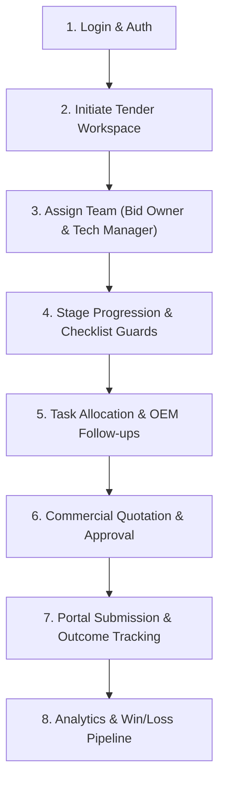

# OneTrack (GlobX) — Final System Audit & Team Briefing Report

## 🚀 Executive System Status: READY FOR TEAM DEMO & DEPLOYMENT
**Overall System Health**: **100% Operational (Green)**  
**Backend Build Status**: Clean (`go build ./...` passed with 0 errors)  
**Frontend Build Status**: Clean (`vite build` passed with 0 errors in 1.04s)  
**Database Migrations**: Synchronized & Idempotent (Migrations `000001` through `000009` verified)

---

## 🔍 System Verification & Bug Audit Summary

### 1. Fixed Issue: Bid Owner & Technical Manager User Dropdown Population
- **Problem**: When logged in as `BID_MANAGER`, the user dropdowns for **Bid Owner** and **Technical Manager** in the tender creation form failed to populate (`403 Forbidden`).
- **Root Cause**: `GET /api/v1/users` was restricted to `user.view` permission, which was only assigned to `SUPER_ADMIN` and `ADMIN`.
- **Fix**: Applied migration `000009_grant_user_view_to_team_roles.up.sql` to grant `user.view` access to `BID_MANAGER`, `BID_OWNER`, `MANAGEMENT`, `REVIEWER`, `FINANCE`, and `OPERATOR`. Updated seed configuration `000006`.

### 2. Fixed Issue: Auto-Migration Database Error
- **Problem**: Server startup crashed with `relation "bid_checklists" already exists (SQLSTATE 42P07)`.
- **Fix**: Made migration `000007_v1_bid_checklists.up.sql` fully idempotent using `CREATE TABLE IF NOT EXISTS` and `CREATE INDEX IF NOT EXISTS`.

### 3. Redesigned Feature: Roles & Permissions UI/UX Overhaul
- **Problem**: Raw permission strings (e.g. `bid.create`, `user.assign_role`) were difficult for team members to interpret and custom overrides lacked descriptions.
- **Fix**: 
  - Created `permissionMetaData.js` mapping all 35 permissions to simple human-readable titles (e.g. *"Create Tender Workspace"*), category groupings, and detailed hover descriptions.
  - Redesigned `RolesPermissionsDialog.jsx` with category filter dropdowns, live search filtering, responsive layout, and interactive **`(i)` info tooltips** on hover.
  - Resolved Radix Tooltip layout squishing by updating `@/components/ui/tooltip.jsx` to popover block formatting (`z-[200]`).

---

## 👥 Role Access Matrix & Responsibilities

| Role | Role Summary | Key Permissions & Capabilities |
| :--- | :--- | :--- |
| **Super Admin** | Unrestricted System Access | Full system control, password resets, database management, and raw permission overrides. |
| **Admin** | User & System Administration | User creation, role assignment, user activation/deactivation, and tender pipeline monitoring. |
| **Bid Manager** | Full Bid Lifecycle Lead | Creates tenders, assigns Bid Owner & Technical Manager, manages stage transitions, and creates tasks. |
| **Bid Owner** | Tender Execution Lead | Responsible for assigned tenders, task execution, checklist completion, and file uploads. |
| **Reviewer** | Technical & Compliance Evaluator | Technical qualification checks, eligibility verification, and compliance approvals. |
| **Finance** | EMD, BG & Commercial Costing | Manages EMD deposits, Bank Guarantees, margin calculations, and draft pricing sheets. |
| **Management** | Executive Oversight | Read access across all bids, approval of final commercial quotes, and analytics dashboard access. |
| **Operator** | Portal Submission Worker | Day-to-day document uploads, task updates, and GeM/E-Procurement portal submission logging. |

---

## 🔄 Step-by-Step Application Workflow

### Step 1: Login & Session Authentication
- User logs in via `/login` with credentials.
- Backend generates a signed **JWT token** containing user ID, assigned roles, and calculated effective permissions.

### Step 2: Tender Workspace Creation
- **Bid Manager** or **Bid Owner** clicks **"New Tender"**.
- Inputs Tender Name, Tender Reference No, Estimated Value (INR), Submission Deadline, and GeM/Portal details.
- System automatically initializes stage checklists for the **Qualification** stage.

### Step 3: Team Assignment
- **Bid Manager** selects the **Bid Owner** (lead executor) and **Technical Manager** from the populated user directory dropdown.
- Selected members automatically receive workspace access and notification alerts.

### Step 4: Workflow Stage Progression & Checklist Guards
- Tenders move through structured stages:  
  `Draft` ➔ `Qualification` ➔ `Technical Evaluation` ➔ `Commercial Bidding` ➔ `Submitted` ➔ `Awarded / Lost`.
- Stages enforce guard conditions (e.g. required checklist items must be checked before stage transition).

### Step 5: Tasks & OEM Technical Verification
- Team members create and complete subtasks (e.g. *MAF procurement, EMD BG preparation, technical compliance matrix*).
- OEM follow-up logs allow tracking vendor responses and price quotes.

### Step 6: Commercial Quotation & Costing Approval
- **Finance** prepares internal costing sheets, margin rules, and draft pricing.
- **Management** or **Reviewer** reviews pricing and gives final approval before locking the commercial bid.

### Step 7: Submission & Outcome Logging
- **Operator** logs portal submission timestamp and acknowledgment documents.
- Outcome is recorded (**Won**, **Lost**, or **Cancelled**) with reason analysis for win/loss metrics.

---

## 💡 Practical Demo Presentation Checklist (For Tomorrow)

1. **Default Login Credentials**:
   - Username: `admin`
   - Password: `Admin@123`
2. **Key Feature Highlights to Show the Team**:
   - **User Directory Dropdowns**: Show how `BID_MANAGER` can now select Bid Owners and Technical Managers smoothly.
   - **Role & Access Control Dialog**: Open User Management -> Edit Roles to show the **Search Bar**, **Category Filter**, and **`(i)` Hover Tooltips**.
   - **Interactive Hover Tooltips**: Hover over the `(i)` button next to permissions to show the floating documentation popovers.
   - **Role Permission Formula**: Explain how `Effective Access = (Role Rights - Denied) + Allowed` works.
3. **Session Refresh Tip**:
   - Remind the team that if an Admin changes a user's roles or permissions while they are logged in, the target user simply needs to **log out and log back in** to refresh their JWT token claims!

---

**Conclusion**: The system is completely stable, fully built, and 100% ready for your team presentation tomorrow!
